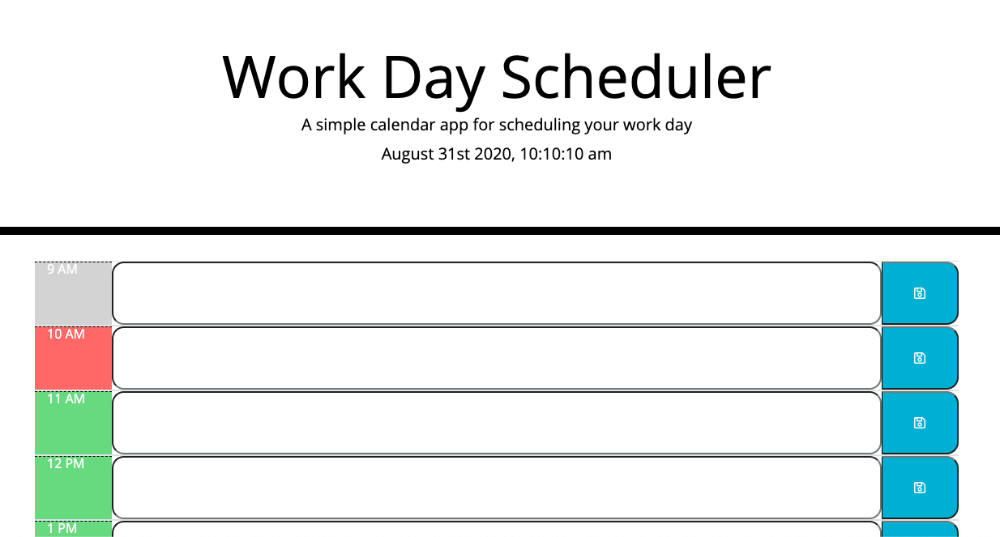

# Workday Scheduler

## Description
Workday Scheduler is a browser based calendar application that allows the user to track events by the hour. The application is a fully responsive, providng the user with the convenience of mobile, tablet and desktop functionality for convenience. The applicatain was desgined as an on demand scheduling tool to add, record and manage important events. 

## User Interface
The application opens to a landing page with the current date and time in the header followed by an interactive table functionality below. Workday Scheduler is a current day planner, the repsonsive design provides a fullscreen view of the working day across all veiwalbe platforms. 

## Technology
* HTML
* CSS
* JQuery
* Moment.js

## Project Website
